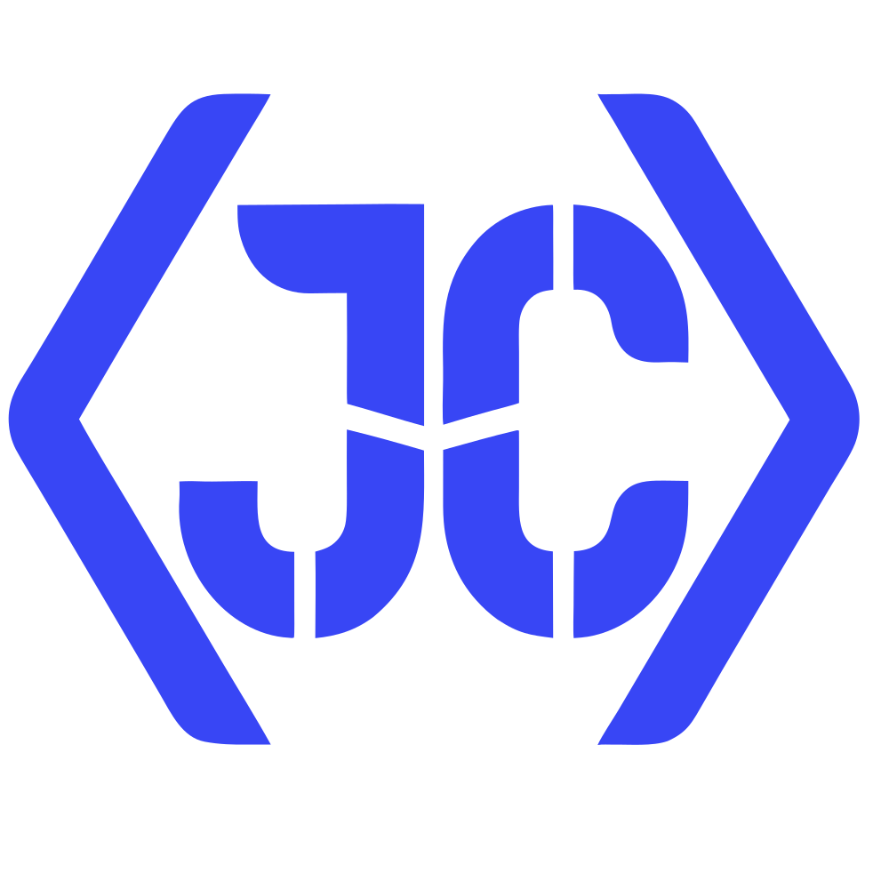

<a id="top"></a>

<div align="center">

  <a href="https://github.com/Juan-Cutiva/portafolio">
    
  </a>

  <h1>Portafolio · Juan David Cutiva López</h1>

  <p>
    Portafolio bilingüe (ES/EN) del desarrollador Frontend Juan David Cutiva López — <br />
    case studies en Markdown, Open Graph dinámico y SEO exhaustivo.
  </p>

  <p>
    <a href="https://portafolio-cuti.vercel.app"><strong>Ver demo »</strong></a>
    ·
    <a href="https://github.com/Juan-Cutiva/portafolio/issues">Reportar bug</a>
    ·
    <a href="https://github.com/Juan-Cutiva/portafolio/issues">Pedir feature</a>
  </p>

  <p>
    <a href="https://astro.build"></a>
    <a href="https://tailwindcss.com"></a>
    <a href="https://www.typescriptlang.org"></a>
    <a href="https://vercel.com"></a>
    <a href="#licencia"></a>
  </p>

</div>

---

## Tabla de contenidos

<details open>
<summary>Expandir / contraer</summary>

- [Sobre el proyecto](#sobre-el-proyecto)
  - [Stack](#stack)
- [Empezar](#empezar)
  - [Requisitos](#requisitos)
  - [Instalación](#instalación)
- [Uso](#uso)
- [Características destacadas](#características-destacadas)
- [Estructura del proyecto](#estructura-del-proyecto)
- [Scripts](#scripts)
- [Configuración](#configuración)
- [Arquitectura](#arquitectura)
- [SEO](#seo)
- [Despliegue](#despliegue)
- [Roadmap](#roadmap)
- [Editar el contenido](#editar-el-contenido)
- [Convenciones](#convenciones)
- [Contacto](#contacto)
- [Agradecimientos](#agradecimientos)
- [Licencia](#licencia)

</details>

---

## Sobre el proyecto

Sitio personal de **Juan David Cutiva López**, Frontend Developer radicado en Bogotá.

El reto fue construir un portafolio que sirviera tanto a reclutadores (rápido, escaneable, responsive) como a desarrolladores (código abierto, arquitectura clara, decisiones técnicas visibles). La solución combina **render estático** (HTML servido desde CDN), **Content Collections** (contenido en Markdown con schema tipado), e **i18n nativo** (español en la raíz, inglés bajo `/en/`) — manteniendo un único endpoint SSR para generar Open Graph dinámico por ruta.

<p align="right">(<a href="#top">volver arriba</a>)</p>

### Stack

<p>
  
  
  
  
  
  
</p>

Librerías clave (dependencias de producción):

| Categoría  | Paquete                                                             |
| ---------- | ------------------------------------------------------------------- |
| Framework  | `astro@6` · `@astrojs/vercel` · `@astrojs/sitemap`                  |
| UI         | `tailwindcss@4` · `astro-icon` · `motion@12`                        |
| Content    | Astro Content Layer API · Zod (via `astro:schema`)                  |
| Open Graph | `satori` · `satori-html` · `sharp`                                  |
| PDF → PNG  | `pdfjs-dist` · `@napi-rs/canvas`                                    |
| Utilidades | `clsx` · `tailwind-merge`                                           |
| Dev        | `@astrojs/check` · `prettier` (`-astro`, `-tailwindcss`) · `eslint` |

<p align="right">(<a href="#top">volver arriba</a>)</p>

---

## Empezar

### Requisitos

- [Node.js](https://nodejs.org) `>= 22.12.0` (definido en `engines` de `package.json`).
- `npm` o un gestor equivalente.

### Instalación

```sh
# 1. Clonar el repo
git clone https://github.com/Juan-Cutiva/portafolio.git
cd portafolio

# 2. Instalar dependencias
npm install

# 3. Copiar el archivo de entorno y editarlo
cp .env.example .env

# 4. Arrancar el dev server
npm run dev
```

Abre [http://localhost:4321](http://localhost:4321). El hook `predev` se encarga automáticamente de generar los PNGs de los certificados PDF la primera vez.

<p align="right">(<a href="#top">volver arriba</a>)</p>

---

## Uso

El sitio trae contenido real. Para adaptarlo a otro desarrollador:

1. Reemplazar los archivos de `src/content/` (proyectos, formación, certificaciones) — cada entrada es un `.md`.
2. Editar `src/data/experience.ts` con tu historial laboral.
3. Editar `src/data/skills.ts` con tu stack.
4. Subir tus imágenes a `public/images/` (proyectos, formación, about, `me.jpg`).
5. Ajustar `src/i18n/ui.ts` con tus textos (eyebrows, títulos, descripciones).
6. Configurar `PUBLIC_SITE_URL` en `.env` y deployar a Vercel.

Guía detallada paso a paso en **[GUIDE.md](GUIDE.md)** — no hace falta tocar componentes ni rutas para añadir contenido.

<p align="right">(<a href="#top">volver arriba</a>)</p>

---

## Características destacadas

- **Bilingüe ES/EN** — i18n nativo de Astro (`prefixDefaultLocale: false`). Selector dropdown con banderas CO/US. Cada colección mantiene el mismo slug en ambos idiomas (las traducciones viven bajo `en/`).
- **Tema dark/light** — Tokens OKLCH con matiz azulado sutil. Anti-FOUC inline antes del primer paint. Toggle persistido en `localStorage`. Se reconcilia en `astro:before-swap` para evitar flicker de iconos sun/moon.
- **Contenido en Markdown** — Cuatro Content Collections (`projects`, `education`, `certifications`, `personal`) con schema Zod. Añadir un proyecto = crear un `.md`.
- **Open Graph dinámico** — Endpoint `/api/og` en runtime Node de Vercel. `satori` construye SVG, `sharp` lo convierte a PNG 1200×630. Fallback estático incluido.
- **PDFs como imagen nítida** — Los certificados en PDF se renderizan a PNG de 1700 px en build time con `pdfjs-dist` + `@napi-rs/canvas`.
- **Animaciones performantes** — `motion` se importa dinámicamente: las rutas sin animaciones no descargan la librería. Typewriter en el Hero, reveal por viewport, morph entre thumbnail y case study con View Transitions.
- **SEO exhaustivo** — JSON-LD por tipo de página, hreflang por locale, sitemap con alternates, preload de LCP, `rel="me"` IndieWeb.
- **Accesibilidad** — Skip link, focus traps, ARIA completo, contrastes WCAG AA validados, respeto de `prefers-reduced-motion`.

<p align="right">(<a href="#top">volver arriba</a>)</p>

---

## Estructura del proyecto

```
.
├── public/
│   ├── certifications/             PDFs de certificados (convertidos a PNG en build)
│   ├── images/                     about/, projects/, education/, certifications/
│   ├── juan-cutiva-cv.pdf          CV descargable
│   └── robots.txt                  directivas + sitemap
│
├── scripts/
│   └── generate-pdf-previews.mjs   pre-hook: pdfjs-dist → PNG 1700px
│
├── src/
│   ├── components/
│   │   ├── CaseStudyHeader.astro   header compartido de case studies
│   │   ├── PdfPreview.astro        PNG pre-generado con fallback a pdf.js
│   │   ├── ProjectsGrid.astro      grid con sharedTransition
│   │   ├── case-study/             ProjectCaseStudy, EducationCaseStudy,
│   │   │                           CertificationCaseStudy, AllProjects, AboutMePage
│   │   ├── layout/                 Header, Nav (scroll-spy), Footer, MobileDrawer
│   │   ├── sections/               Hero, About, Experience, Projects, Skills,
│   │   │                           Education, Contact
│   │   └── ui/                     Button, SectionTitle, BurgerButton,
│   │                               ThemeToggle, LanguageToggle
│   │
│   ├── content/
│   │   ├── projects/               .md por proyecto (ES raíz, EN bajo en/)
│   │   ├── education/              .md por formación
│   │   ├── certifications/         .md por certificación
│   │   └── personal/               sobre-mi.md (ES + EN)
│   │
│   ├── content.config.ts           schemas Zod de las 4 colecciones
│   ├── data/                       skills, experience (por locale), navigation
│   ├── i18n/                       ui.ts (dicts + helpers) + collections.ts
│   ├── layouts/Layout.astro        shell raíz (SEO, JSON-LD, theme, ClientRouter)
│   ├── lib/                        animations, theme, age, utils
│   ├── pages/                      home, contact, sobre-mi, 404, api/og,
│   │                               projects/, education/, certifications/, en/
│   ├── styles/global.css           tokens OKLCH + @theme + .case-study-prose
│   └── types/portfolio.ts          tipos compartidos
│
├── astro.config.mjs
├── tsconfig.json                   path aliases @/*, @components/*, @layouts/*, @styles/*
├── vercel.json                     headers de seguridad + caching
├── GUIDE.md                        guía de contenido
├── MANUAL_TASKS.md                 pendientes pre/post-deploy
└── README.md
```

<p align="right">(<a href="#top">volver arriba</a>)</p>

---

## Scripts

| Comando               | Descripción                                                              |
| --------------------- | ------------------------------------------------------------------------ |
| `npm run dev`         | Servidor local en `:4321` (pre-hook regenera PNGs de PDFs nuevos)        |
| `npm run build`       | Build de producción a `dist/` (mismo pre-hook)                           |
| `npm run preview`     | Sirve el build local                                                     |
| `npm run previews`    | Regenera manualmente los PNGs desde los PDFs de `public/certifications/` |
| `npm run astro check` | Chequeo de tipos y diagnósticos                                          |

<p align="right">(<a href="#top">volver arriba</a>)</p>

---

## Configuración

Variables de entorno requeridas (copiar `.env.example` a `.env`):

| Variable          | Requerida | Descripción                                                                                                             |
| ----------------- | :-------: | ----------------------------------------------------------------------------------------------------------------------- |
| `PUBLIC_SITE_URL` |    ✅     | URL canónica del sitio. Sitemap, canonicals y `og:*` dependen de esto. En local el fallback es el placeholder del repo. |

<p align="right">(<a href="#top">volver arriba</a>)</p>

---

## Arquitectura

<details>
<summary><strong>Render híbrido</strong></summary>

`output: 'server'` + adapter de Vercel habilita el runtime Node para `/api/og`, pero cada página marca `prerender = true` y se genera como HTML estático. El 99 % del tráfico se sirve desde el CDN.

</details>

<details>
<summary><strong>i18n</strong></summary>

Nativo de Astro con `prefixDefaultLocale: false`. Español en la raíz, inglés bajo `/en/`. Las colecciones mantienen el mismo slug — las traducciones viven bajo `en/` (`src/content/projects/en/mi-slug.md`) y un helper (`getLocalizedCollection`) filtra por locale. El selector de idioma es un dropdown con `data-astro-reload` para refrescar `<html lang>`, canonicals y Open Graph al cambiar.

</details>

<details>
<summary><strong>Temas dark/light</strong></summary>

Script inline anti-FOUC en `<head>` aplica `.dark` antes del primer paint (default `dark`). Los tokens OKLCH están escalonados `bg < surface < elevated` en ambos modos para que la jerarquía visual sea coherente. El tema se persiste en `localStorage['theme']` y se reconcilia en cada View Transition con `astro:before-swap` — modifica el `newDocument` antes del paint para evitar flicker de iconos.

</details>

<details>
<summary><strong>Drawer móvil</strong></summary>

Vive en `<body>` **fuera del header** a propósito: el `backdrop-filter` del header crea un containing block que atrapaba el `position: fixed` del panel. El estado se guarda en `data-drawer-open` del `<html>` para sobrevivir a las View Transitions. Incluye focus trap, Esc, scroll-lock y cierre automático al cruzar el breakpoint `md+`.

</details>

<details>
<summary><strong>Nav con scroll-spy</strong></summary>

`IntersectionObserver` detecta qué sección está en el 40-55 % del viewport y marca `data-section-active` en el link correspondiente. El underline animado aparece en hover, focus o scroll-active. Los enlaces con `#` **nunca** reciben `aria-current="page"` — eso lo maneja exclusivamente el scroll-spy para evitar que todos queden activos en home.

</details>

<details>
<summary><strong>Case studies desde Markdown</strong></summary>

Cada `.md` en `src/content/{projects,education,certifications}/` (o bajo `en/`) genera una ruta pre-renderizada `/<tipo>/<slug>` y `/en/<tipo>/<slug>`. Los renderers de `src/components/case-study/` reciben la entry + `locale` y arman todo: header, meta grid, prose, schemas SEO, breadcrumb, CTA. Las rutas `.astro` quedan como wrappers finos.

</details>

<details>
<summary><strong>Open Graph dinámico</strong></summary>

Cada case study pasa `image={/api/og?type=...&slug=...}` al Layout. El endpoint descarga Inter Bold de jsDelivr una vez (cache en memoria), genera SVG con `satori` y lo convierte a PNG con `sharp`. Fallback estático a `/og-image.png` si falla.

</details>

<details>
<summary><strong>PDFs → imagen nítida</strong></summary>

El script `scripts/generate-pdf-previews.mjs` usa `pdfjs-dist` + `@napi-rs/canvas` para renderizar cada PDF de `public/certifications/` a 1700 px en `public/images/certifications/`. Los hooks `predev`/`prebuild` lo ejecutan automáticamente y solo regeneran si el PDF es más reciente que el PNG.

</details>

<details>
<summary><strong>View Transitions en imágenes</strong></summary>

`ProjectsGrid` acepta `sharedTransition` y añade `transition:name="project-media-<id>"` a cada ``. Al navegar de home/listado a `/projects/[slug]`, Astro hace morph fluido entre thumbnail y la imagen principal del case study.

</details>

<p align="right">(<a href="#top">volver arriba</a>)</p>

---

## SEO

| Recurso                  | Detalle                                                                                                                                                                                                                                                                                                |
| ------------------------ | ------------------------------------------------------------------------------------------------------------------------------------------------------------------------------------------------------------------------------------------------------------------------------------------------------ |
| **JSON-LD**              | `Person`, `WebSite` globales. `ProfilePage` en home, `AboutPage` en `/sobre-mi`, `ContactPage` en `/contact`, `ItemList` en `/projects`. `CreativeWork`, `EducationalOccupationalProgram`, `EducationalOccupationalCredential` por tipo. `BreadcrumbList` en todas las hijas. `dateModified` en todas. |
| **Open Graph**           | `og:type`, `og:locale` + `og:locale:alternate`, `og:image` con `width`/`height`/`alt`/`type`/`secure_url`. `article:*` en case studies con `publishedTime` y `modifiedTime`.                                                                                                                           |
| **Twitter Cards**        | `summary_large_image`.                                                                                                                                                                                                                                                                                 |
| **hreflang**             | `es-CO`, `en`, `x-default`. Layout acepta `availableLocales` para emitir solo idiomas donde existe la ruta.                                                                                                                                                                                            |
| **Sitemap**              | `@astrojs/sitemap` con `i18n` config — cada URL emite `xhtml:link alternate`. Priority 1.0 en home y `/projects`, 0.7 en el resto.                                                                                                                                                                     |
| **Robots**               | `max-image-preview:large, max-snippet:-1, max-video-preview:-1`. `noindex` en 404.                                                                                                                                                                                                                     |
| **Meta**                 | `color-scheme`, `format-detection`, `keywords` por locale, `rel="me"` (IndieWeb) a GitHub/LinkedIn/Instagram/email.                                                                                                                                                                                    |
| **Preload / preconnect** | LCP preload del retrato en `/sobre-mi`. Preconnect a `cdn.jsdelivr.net` para el cold start de `/api/og`.                                                                                                                                                                                               |

<p align="right">(<a href="#top">volver arriba</a>)</p>

---

## Despliegue

Target: **Vercel**. El adapter maneja SSR (`/api/og`) en el runtime Node y estático para el resto.

<p align="right">(<a href="#top">volver arriba</a>)</p>

---

## Editar el contenido

Todo el contenido del portafolio se edita desde `.md` o `.ts` — sin tocar componentes ni rutas.

📖 **[GUIDE.md](GUIDE.md)** cubre:

- Añadir / editar proyectos, formación, certificaciones
- Flujo automático PDF → PNG
- Añadir skills y experiencia
- Reordenar el menú
- Editar la página "Sobre mí"
- Traducir al inglés

<p align="right">(<a href="#top">volver arriba</a>)</p>

---

## Convenciones

- **Comentarios** en español; **identificadores** (variables, funciones, archivos, exports) en inglés.
- **Commits** en [Conventional Commits](https://www.conventionalcommits.org). Asunto en inglés imperativo, cuerpo opcional en español.
- **Path aliases** en [tsconfig.json](tsconfig.json): `@/*`, `@components/*`, `@layouts/*`, `@styles/*`.
- **Tailwind primero**: las clases inline son la regla; solo se usa `<style>` para animaciones con `@keyframes`, selectores de ancestro (`html[data-...]`) o SVG (`stroke-dasharray`).

<p align="right">(<a href="#top">volver arriba</a>)</p>

---

## Contacto

**Juan David Cutiva López** — Frontend Developer, Bogotá, Colombia.

[](https://github.com/Juan-Cutiva)
[](https://linkedin.com/in/juandavidcutivalopez)
[](https://www.instagram.com/juan.cutiva_/)
[](mailto:juandavidcutiva.jdc@gmail.com)

<p align="right">(<a href="#top">volver arriba</a>)</p>

---

## Agradecimientos

- [Astro](https://astro.build) — el framework que hace que todo esto sea fácil y rápido.
- [TailwindCSS](https://tailwindcss.com) — la sintaxis que acelera el desarrollo sin sacrificar consistencia.
- [motion](https://motion.dev) — animaciones declarativas y performantes.
- [Iconify](https://iconify.design) — acceso unificado a miles de iconos ([Lucide](https://lucide.dev), [Simple Icons](https://simpleicons.org), flags).
- [satori](https://github.com/vercel/satori) — la magia detrás del Open Graph dinámico.
- [midudev](https://www.youtube.com/@midudev) — por su contribución constante a la comunidad hispanoparlante de desarrollo.
- [Best-README-Template](https://github.com/othneildrew/Best-README-Template) — referencia estructural para este README.

<p align="right">(<a href="#top">volver arriba</a>)</p>

---

## Licencia

Distribuido bajo licencia **MIT** para el código.

El contenido (textos, imágenes, CV, certificados) es propiedad de **Juan David Cutiva López** y no está cubierto por la licencia MIT.

<p align="right">(<a href="#top">volver arriba</a>)</p>
